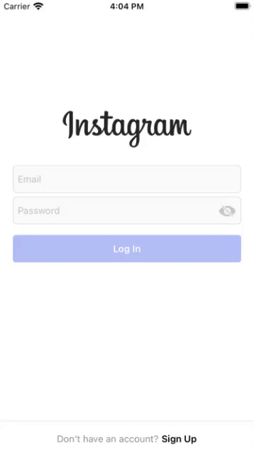
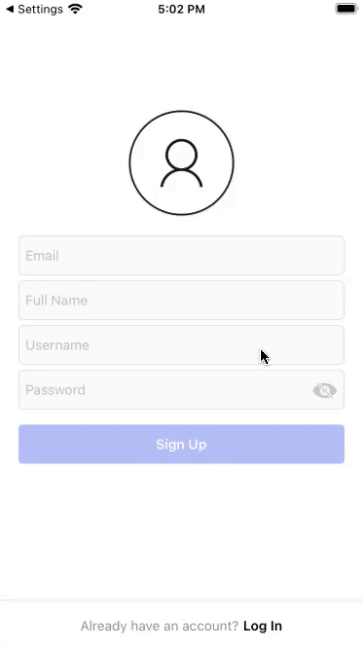
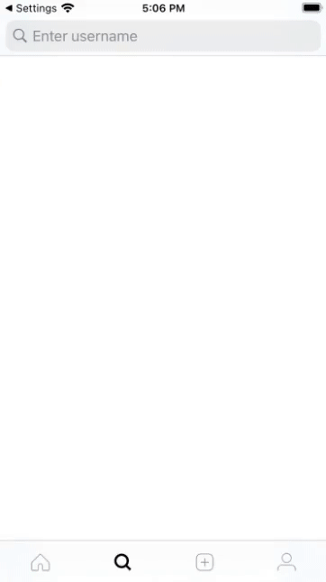
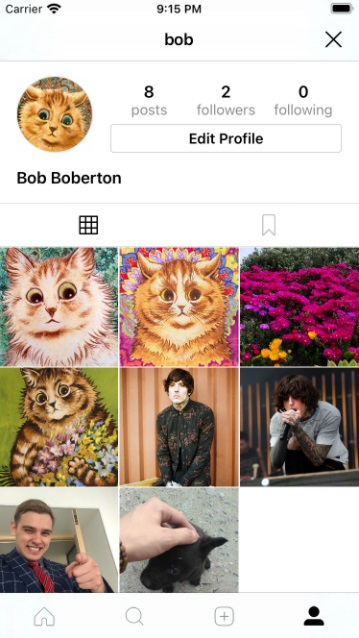

# Instagram Clone

Сильно упрощённый вариант приложения Instagram, написанный с применением БД в реальном времени **Firebase** и архитектуры **MVP+Coordinator**.  

Для создание динамических ячеек и хедеров **UICollectionView** использовался **UICollectionViewCompositionalLayout**. В ходе работы были выявлены несколько багов 
из-за использования **UICollectionViewCompositionalLayout** с ДИНАМИЧЕСКИМИ размерами:
* **UICollectionView** воспринимает размер динамической ячейки или хедер вью как минимальный, равный 44;
* **UICollectionView** многократно создаёт уже созданные ячейки.  

Причины, по которым возникают данные баги так и не получилось найти. Данные баги вызывают проблему с постраничной загрузкой данных, но для её решения был использован 
(довольно глупый) способ решения с запоминанием последней отображённой ячейки. Это позволяет корректно обрабатывать запросы на получение новых данных, без многократного вызов, 
по причине всё того же бага.  

При замене **UICollectionViewCompositionalLayout** на **UICollectionViewFlowLayout** вышеописанные баги исчезали.

## Описание приложения

Приложение состоит из 12 экранов:

### Экран Логина (Login)
Экран для входа в приложение. Содержит поля для ввода email'а и пароля, с соответствующими проверками на корректность ввода. В случае, если введённые данные являются неверными,
под соответствующим полем для ввода будет выведена информация. В случае если данные ввеедены не корректно (пользователь ввёл неправильно пароль) или произошла проблема на 
сервере, будет ввыден соответствующий алёрт (забыл записать гифку).  

Поле для ввода пороля является кастомным 
**UITextField** с переопределённым **RightView**, вместо которого используется кнопка для скрытия/отображения введённых данных.  
Кнопка авторизации является кастомным классом **UIButton** с возможностью отображения состояния активности.

Для всего экрана используется **UIScrollView**, чтобы, в случае отображения клавиатуры, изменить размеры экрана и осуществить сдвиг кнопки перехода на экран Регистрации вверх, 
ближе к полям для ввода (как в реальном Instagram приложении xD).

|  |
| :------------------:|
  

### Экран Регистрации (Registration)
Экран регистрации аналогичен экрану Логина, за исклчением того, что содержит поля для ввода полного имени, имени пользователя и кнопку для выбора картинки профиля.

Также как и с Логином, для всего экрана используется **UIScrollView**, поиом того, что, в случае отображения клавиатуры, изменяется размер экрана и осуществляется сдвиг кнопки 
перехода на экран Логинавверх, ближе к полям для ввода, происходит сдвиг всеех элементов вверх, чтобы клавиатура не могла их перекрыть (опять же, как в реальном Instagram 
приложении).

|  |
| :-------------------------:|

### Экран ленты постов (Home)
Экран, который видит пользователь когда заходит в приложение. Отображает посты пользователя и всех тех, на кого он подписан. На данном экране можно перейти к профилю 
пользователя, который является автором поста, посмотреть комментарии под ним, поставить отметку "Like" или добавить пост в закладки.  

Данный экран использует построничную загрузку. По мере скроллинга вниз будут подгружаться предыдущие посты. Также экран можно потянуть вниз, чтобы обновить данные.

| 
  
 |
| :---------------------------------:|

### Экран комментариев поста (Comments)
Экран, отображающий комментари под постом и позволяющий переходить к профилю комментатора.

|  |
| :---------------------:|

### Экран поиска пользователей (Search)
Экран для поиска профилей пользователей и переходов к ним.

|  |
| :-------------------:|

### Экран выбора изображения для нового поста (ImagePicker) и Экран загрузки поста (SharePost)
Экран выбора изображения для нового поста позволяет просматривать и выбирать изображения девайса. Загрузка изображение также устроена постранично, по 8 изображений за раз. 
Выбранное изображение можно отмасштабировать, выбрать область для отображения или оставить как есть и перейти к экрану загрузки поста.  

Экран загрузки поста позовляет создать новый пост из изображения и необязательной подписи к нему. Если выбранное изображение не соответствует одноиму из трёх 
масштабов: **1:1**, **1:1.91**, **4:5**; то изображение будет автоматически подогнано и обрезано под наиболее подходящий формат.

|  |
| :---------------------:|

### Экран профиля (Profile)
Экран отображения профиля пользователя и информации о нём: полное имя, биография, вебсайт. 
Позволяет перейти к экранам с подписками и подписчиками, посмотреть добавленные посты или избранные посты, а также отредактировать 
информацию профиля.  
Если просматриваемый профиль является профилем другого пользователя, в зависимости от того, находится ли профиль в подписках, на него можно будет подписаться или отписаться.

| 
  
 |
| :------------------------------------:|

### Экран просмотр и редактирование подписчиков/подписок (FollowersFollowing)
Экран подписчиков позволяет просматривать подписчиков и удалять подписку конкретного человека на свой аккаунт. Экран подписок позволяет просматривать подписчиков и 
отписываться от них, в случае необходимости. 

|  |
| :----------------------------------------:|

### Экран редактирования профиля (EditProfile), Экран редактирования биографии (EditProfileBio) и Экран редактирования имени пользователя (EditProfileUsername)
Экран редактирования профиля позволяет изменять информацию указанную при регистрации, за исключением email'а. При нажатии на поле для ввода биографии или имени пользователя 
произойдёт переход на отдельный экран для редактирования данной информации.  

Экран редактирования биографии позволяет вводить многострочную информацию и показывает общее количество введённых символов. В случае если количество символов выйдет за 
установленный лимит, количество символов будет подсвечено красным цветом, а кнопка для сохранения изменений станет недоступной.  

Экране редактирования имени пользователя позволяет проверить введённое имя пользователя и получить моментальную информацию о том, является ли введённое имя пользователя 
корректным, доступным для изменения или не пустым. В противном случае будет выведено соответствующее сообщение и кнопка для сохранения изменений станет недоступной.  

В случае если в процессе редактирования профиля произойдут какие-либо проблемы, на экран будет выведен соответствующий алёрт.

|  |
| :-------------------------:|
